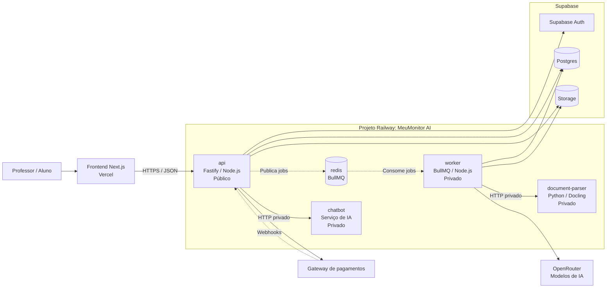

# Deploy V1 — MeuMonitor AI

> **Plano de implantação:** primeira versão de produção com frontend na Vercel, processos backend na Railway e serviços gerenciados do Supabase.

**Objetivo:** colocar o frontend, a API, o worker, o parser Docling e o Redis em produção com limites claros entre os processos, permitindo escalar cada componente separadamente no futuro.

**Arquitetura:** a V1 utiliza um projeto Railway com múltiplos serviços independentes. API e worker continuam usando o mesmo código TypeScript, mas são executados em containers separados. O parser Docling roda como serviço Python/Docker separado. Supabase permanece responsável por Auth, Postgres e Storage.

**Stack de deploy:** Vercel, Railway, Node.js/TypeScript, Fastify, BullMQ, Redis, Python 3.12, Docling, Supabase e OpenRouter.

## 1. Decisões da V1

- Frontend Next.js: Vercel.
- API HTTP: Railway, serviço público `api`.
- Worker BullMQ: Railway, serviço privado `worker`.
- Parser Docling: Railway, serviço privado `document-parser` usando Dockerfile próprio.
- Chatbot do aluno: Railway, serviço privado `chatbot`, quando o código do serviço estiver pronto.
- Redis: serviço Redis da Railway, utilizado pela API e pelo worker.
- Auth: Supabase Auth.
- Banco: Supabase Postgres.
- Arquivos: Supabase Storage.
- Modelos de IA: OpenRouter.
- Gateway de pagamentos: serviço externo, integrado pela API/Billing.
- Não utilizar Docker Compose como unidade de deploy. Cada serviço deve ser criado como um serviço Railway independente.
- Não colocar API, worker e parser no mesmo processo/container.

## 2. Topologia de produção



## 3. Serviços Railway

### 3.1 Serviço `api`

Responsável pelas requisições HTTP do frontend, autenticação, monitores, documentos, alunos, compras, revisão de conteúdo e entrada para o chatbot.

```text
Nome: api
Origem: repositório do backend
Root directory: /backend, se o backend estiver em um monorepo
Build command: npm ci && npm run prisma:generate && npm run build
Start command: npm run start
Domínio público: sim
Health check: /health
```

O processo já escuta `HOST=0.0.0.0` e utiliza `PORT` por variável de ambiente. A Railway termina HTTPS no edge; o Node pode continuar escutando HTTP internamente.

### 3.2 Serviço `worker`

Responsável pelo processamento assíncrono de documentos, embeddings, questões, flashcards e tarefas agendadas.

```text
Nome: worker
Origem: mesmo repositório do backend
Root directory: /backend, se o backend estiver em um monorepo
Build command: npm ci && npm run prisma:generate && npm run build
Start command: npm run worker
Domínio público: não
```

O worker precisa acessar Redis, Postgres, Supabase Storage, Supabase Auth quando necessário, OpenRouter e o parser Docling.

Antes de iniciar processamento, o worker valida a existência dos enums obrigatórios no banco. As migrations devem ser aplicadas antes do primeiro start do worker.

### 3.3 Serviço `document-parser`

Responsável exclusivamente pelo parsing de PDFs com Docling. O serviço não deve acessar Prisma, banco, Storage ou agentes de IA.

```text
Nome: document-parser
Origem: serviço Python do parser
Diretório local atual: services/document-parser
Build: services/document-parser/Dockerfile
Porta interna: 8080
Domínio público: não
Health check: /health
Endpoint principal: POST /v1/parse
```

O `Dockerfile` atual já inicia o serviço com:

```text
python scripts/run_http_server.py --host 0.0.0.0 --port 8080
```

O worker deve acessar o parser pela rede privada da Railway:

```text
DOCUMENT_PARSER_BASE_URL=http://document-parser.railway.internal:8080
```

O parser utiliza cache em memória. Reinicializações limpam esse cache; por isso o resultado persistido no backend continua sendo a fonte de verdade.

### 3.4 Serviço `chatbot`

Serviço reservado para o chatbot do aluno.

Na V1, o frontend não deve acessar diretamente o chatbot. O fluxo recomendado é:

```text
Frontend → API → Chatbot
```

Isso mantém na API:

- autenticação;
- autorização do aluno;
- controle de acesso ao monitor;
- rate limit;
- limites de tokens e custo;
- auditoria das conversas;
- seleção de contexto e modelo.

O serviço pode ser adicionado ao mesmo projeto Railway quando sua implementação estiver pronta:

```text
Nome: chatbot
Domínio público: não inicialmente
URL interna esperada: http://chatbot.railway.internal:<porta>
```

### 3.5 Serviço `redis`

Adicionar o Redis gerenciado pela Railway no mesmo projeto e ambiente da API e do worker.

Os serviços devem compartilhar a mesma conexão:

```text
REDIS_URL=${{redis.REDIS_URL}}
```

Não criar um Redis separado para a API e outro para o worker. Ambos precisam consumir e publicar na mesma fila `monitor-documents`.

## 4. Organização dos repositórios

O workspace atual possui:

```text
MeuMonitorAI/
├── frontend/                 # repositório próprio
├── backend/                  # repositório próprio
└── services/document-parser/ # ainda sem repositório Git próprio
```

Para deploy contínuo pela Railway, o parser deve seguir uma destas opções:

### Opção recomendada: repositório próprio

Criar um repositório para `document-parser` contendo:

```text
Dockerfile
pyproject.toml
uv.lock
README.md
scripts/
tests/
```

Depois conectar esse repositório ao serviço Railway `document-parser`.

### Opção alternativa: monorepo de serviços

Criar um repositório de infraestrutura/serviços contendo:

```text
services/
└── document-parser/
```

Configurar o Root Directory da Railway para `/services/document-parser`.

O parser não deve depender do checkout local do backend para realizar o deploy.

## 5. Serviços externos

### Supabase Auth

Configurar no backend:

```text
SUPABASE_URL
SUPABASE_PUBLISHABLE_KEY
SUPABASE_SERVICE_ROLE_KEY
```

O frontend deve utilizar a configuração pública apropriada do Supabase apenas para os fluxos previstos no frontend. A `SUPABASE_SERVICE_ROLE_KEY` fica somente na API e no worker, nunca na Vercel como variável pública.

### Supabase Postgres

Configurar:

```text
DATABASE_URL
```

Usar uma conexão apropriada para runtime e executar migrations com `prisma migrate deploy` antes de ativar o worker.

### Supabase Storage

O bucket esperado pelo backend é:

```text
monitor-documents
```

O Storage deve estar funcional antes do teste de upload. O worker baixa o arquivo salvo pela API, e o parser pode receber URL assinada conforme o fluxo atual.

### OpenRouter

Configurar no worker as chaves e modelos necessários para embeddings, questões, explicações, tópicos e flashcards. A API só deve receber essas variáveis se o chatbot for executado diretamente nela; caso contrário, as chaves de processamento ficam no worker/chatbot.

## 6. Variáveis de ambiente

### API

```text
NODE_ENV=production
HOST=0.0.0.0
PORT=<injetada pela Railway>

SUPABASE_URL=...
SUPABASE_PUBLISHABLE_KEY=...
SUPABASE_SERVICE_ROLE_KEY=...
DATABASE_URL=...
REDIS_URL=${{redis.REDIS_URL}}

CORS_ORIGINS=https://<dominio-da-vercel>
PAYMENTS_SIMULATION_ENABLED=false
```

### Worker

```text
NODE_ENV=production
SUPABASE_URL=...
SUPABASE_SERVICE_ROLE_KEY=...
DATABASE_URL=...
REDIS_URL=${{redis.REDIS_URL}}

OPENROUTER_API_KEY=...
DOCUMENT_INGESTION_V3_ENABLED=true
DOCUMENT_PARSER_BASE_URL=http://document-parser.railway.internal:8080
DOCUMENT_PARSER_REQUEST_TIMEOUT_MS=30000
DOCUMENT_PARSER_MAX_ATTEMPTS=1
```

Além dessas variáveis, o worker precisa das configurações de modelos que já estão documentadas em `.env.example`.

### Parser

O parser deve receber apenas as variáveis necessárias à execução do serviço Python. Não duplicar nele:

```text
DATABASE_URL
SUPABASE_SERVICE_ROLE_KEY
OPENROUTER_API_KEY
```

### Frontend Vercel

```text
NEXT_PUBLIC_API_URL=https://<dominio-publico-da-api>
```

Configurar também as variáveis públicas do Supabase usadas pelo frontend, se o fluxo de autenticação do frontend depender delas.

## 7. Ordem de implantação

### Fase 0 — Preparar os repositórios

- Confirmar o repositório do backend conectado à Railway.
- Confirmar o repositório do frontend conectado à Vercel.
- Criar repositório próprio para o parser ou um monorepo de serviços.
- Garantir que o `Dockerfile` do parser seja reproduzível sem arquivos locais externos.

### Fase 1 — Preparar o Supabase

- Confirmar projeto Supabase de produção.
- Confirmar Auth e providers.
- Confirmar bucket `monitor-documents`.
- Confirmar `DATABASE_URL` de produção.
- Aplicar migrations com `npx prisma migrate deploy`.
- Validar que os enums exigidos pelo worker estão presentes.

### Fase 2 — Criar o projeto Railway

- Criar o projeto `meumonitor-ai-production`.
- Criar o serviço Redis.
- Criar `document-parser`.
- Criar `api`.
- Criar `worker`.
- Criar `chatbot` quando seu código estiver pronto.
- Configurar as variáveis e referências entre serviços.

### Fase 3 — Validar o parser

Executar:

```text
GET http://document-parser.railway.internal:8080/health
```

Validar também um `POST /v1/parse` com um PDF de teste antes de habilitar o parser no worker.

### Fase 4 — Validar a API

Executar:

```text
GET https://<dominio-da-api>/health
```

Depois validar:

- login;
- sessão autenticada;
- criação de monitor;
- upload de documento;
- consulta de status do documento.

### Fase 5 — Validar a fila e o worker

- Confirmar que a API publica jobs no Redis.
- Confirmar que o worker registra `monitor.document_worker_ready`.
- Confirmar que o worker consome `monitor-documents`.
- Confirmar que o documento muda de `QUEUED` para `PROCESSING`.
- Confirmar o processamento do documento até `READY` ou `PARTIAL_SUCCESS`.
- Confirmar retry e registro de falha.
- Confirmar que `DOCUMENT_PARSER_BASE_URL` aponta para o hostname privado correto.

### Fase 6 — Publicar o frontend

- Configurar `NEXT_PUBLIC_API_URL` na Vercel.
- Configurar domínio final do frontend.
- Adicionar o domínio da Vercel em `CORS_ORIGINS`.
- Testar cookies, Authorization header e upload multipart.
- Validar login de professor e aluno em produção.

## 8. Migrations e inicialização

Migrations não devem ser executadas simultaneamente pelo processo da API e pelo worker.

Executar uma vez por release, antes do worker:

```bash
npx prisma migrate deploy
```

Depois iniciar:

```bash
npm run start
npm run worker
```

O worker deve ser iniciado somente depois de:

- Redis estar disponível;
- Postgres estar com as migrations aplicadas;
- parser estar saudável;
- variáveis de ambiente estarem completas.

Os serviços devem continuar tolerando inicialização fora de ordem, porque a Railway não oferece uma equivalência direta ao `depends_on` do Docker Compose. Conexões devem falhar de forma observável e permitir reinício seguro.

## 9. Scaling

### API

Pode ser escalada horizontalmente porque as sessões, arquivos e dados ficam fora do processo.

```text
api: 1 → 2+ réplicas
```

Antes de aumentar réplicas, validar que nenhuma sessão ou estado temporário depende de memória local.

### Worker

Pode consumir a mesma fila com múltiplas réplicas, mas o scheduler de desafios diários atualmente é iniciado em `src/worker.ts`. Escalar o worker sem separar o scheduler pode gerar execuções duplicadas.

Antes de usar múltiplas réplicas, escolher uma destas opções:

1. separar o scheduler em um serviço Railway próprio;
2. executar o scheduler como Cron Job de uma única instância;
3. implementar lock distribuído no Redis ou Postgres.

### Parser

Pode ser escalado separadamente quando CPU, memória ou tempo de parsing forem o gargalo.

O serviço deve manter:

- contrato HTTP estável;
- idempotência por hash;
- timeout configurado no worker;
- logs de início, sucesso e falha;
- persistência do resultado no backend, não no filesystem efêmero.

### Redis

Não duplicar o Redis para escalar a API ou o worker. API e worker devem continuar apontando para a mesma instância/fila. O Redis só deve ser movido ou convertido para alta disponibilidade quando houver necessidade operacional real.

## 10. Migração futura de um serviço

Se apenas um componente precisar de mais recursos, primeiro escalar esse serviço dentro do projeto Railway.

Exemplo:

```text
document-parser: 1 réplica → 2 réplicas
```

Se ainda for necessário mover o componente para outro projeto ou provedor:

1. criar o novo serviço com a mesma imagem/contrato;
2. configurar as mesmas variáveis necessárias;
3. expor o novo endpoint com autenticação;
4. apontar a variável `DOCUMENT_PARSER_BASE_URL` para a nova URL;
5. validar health check e parsing de teste;
6. acompanhar logs e falhas;
7. remover o serviço antigo somente após a validação.

O contrato entre serviços deve ser baseado em URLs e variáveis de ambiente, nunca em imports diretos entre API, worker, parser ou chatbot.

## 11. Observabilidade mínima

Cada serviço deve ter:

- logs de inicialização;
- logs de conexão com dependências;
- health check;
- identificação do serviço e ambiente;
- logs sem tokens, senhas, CPF ou chaves de API;
- métrica ou log para duração e falha de processamento.

Eventos importantes já existentes no backend incluem:

```text
monitor.document_worker_ready
monitor.document_job_completed
monitor.document_job_failed
monitor.document_processing_started
monitor.document_worker_completed
monitor.document_ingestion_v3_started
monitor.document_ingestion_v3_shadow_completed
```

## 12. Rollback

### API

Reverter o deployment da API para a versão anterior e manter o frontend apontando para o mesmo domínio.

### Worker

Reverter o worker sem apagar jobs pendentes. Validar compatibilidade entre a versão do worker e o `processingVersion` dos documentos.

### Parser

Reverter a imagem do parser e manter o contrato `/health` e `/v1/parse` compatível.

### Banco

Não executar rollback destrutivo automático de migration. Migrations devem ser aditivas ou acompanhadas de procedimento de recuperação explícito.

## 13. Critérios de aceite da V1

- [ ] Frontend publicado na Vercel.
- [ ] API publicada na Railway com domínio HTTPS.
- [ ] `GET /health` da API respondendo `200`.
- [ ] Worker conectado ao Redis.
- [ ] Redis acessível pela API e pelo worker.
- [ ] Parser Docling respondendo `GET /health`.
- [ ] Worker acessando o parser por rede privada.
- [ ] Migrations de produção aplicadas antes do worker.
- [ ] Login de professor funcionando.
- [ ] Login de aluno funcionando.
- [ ] Upload de documento funcionando.
- [ ] Job aparecendo na fila `monitor-documents`.
- [ ] Worker processando um documento de teste.
- [ ] Status do documento consultável pela API.
- [ ] Falha do parser registrada sem expor segredo.
- [ ] CORS aceitando somente o domínio correto da Vercel.
- [ ] Chatbot integrado apenas pela API quando o serviço estiver disponível.
- [ ] Scheduler não executando duplicado caso o worker seja escalado.

## 14. Referências operacionais

- [Railway Services](https://docs.railway.com/services)
- [Railway Monorepos](https://docs.railway.com/deployments/monorepo)
- [Railway Private Networking](https://docs.railway.com/networking/private-networking)
- [Railway Scaling](https://docs.railway.com/deployments/scaling)
- [Railway Redis](https://docs.railway.com/databases/redis)
- [Railway Variables](https://docs.railway.com/variables)
