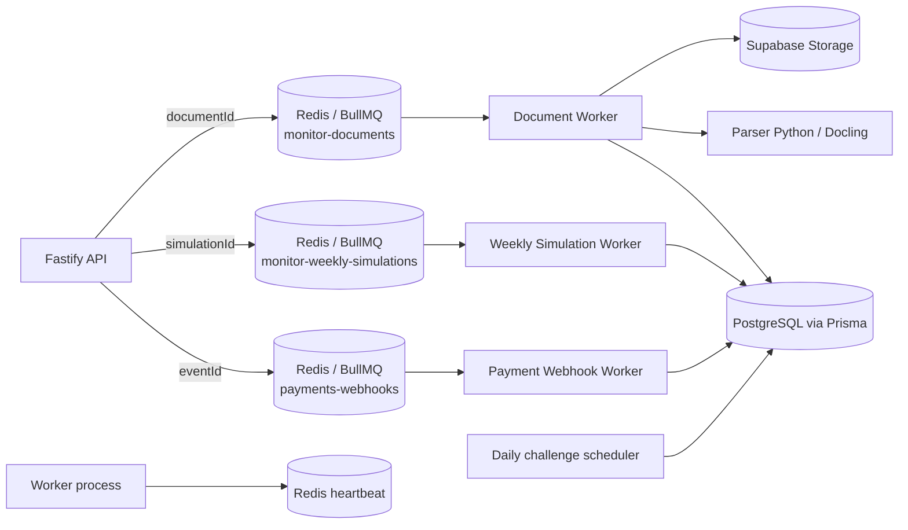

# Worker do backend — arquitetura e responsabilidades

## Visão geral

O worker é um processo Node.js separado da API HTTP. Ele consome jobs do BullMQ pelo Redis, executa tarefas assíncronas que não devem bloquear requisições web e grava o estado durável no PostgreSQL/Supabase. O processo atual concentra três consumidores de fila, um agendador diário e uma rotina de recuperação de webhooks.

O worker não é um servidor HTTP e não recebe arquivos diretamente do navegador. A API salva o documento no Supabase Storage e publica apenas o `documentId` na fila. O worker busca o documento, processa-o e atualiza o banco.

## Inicialização

O entrypoint é `backend/src/worker.ts`. A inicialização ocorre no nível do módulo, portanto uma falha nas validações abaixo impede o processo de ficar parcialmente ativo:

1. Carrega e valida as variáveis de ambiente.
2. Consulta o PostgreSQL para confirmar que os valores `CORRECTION` e `NORMALIZATION` existem no enum `QuestionAiGenerationType`.
3. Cria a conexão Redis compartilhada pelos workers de documentos e simulados.
4. Inicia o heartbeat `monitor:worker:heartbeat:v1`, renovado a cada 30 segundos com TTL de 90 segundos.
5. Instancia serviços de documento, simulado, pagamento e o agendador de desafios diários.
6. Executa a recuperação de webhooks pendentes e agenda novas recuperações a cada 60 segundos.
7. Registra os três consumidores BullMQ.

O processo encerra com `SIGINT` ou `SIGTERM`: para o heartbeat e o scheduler, interrompe a recuperação, fecha os workers, encerra Redis e desconecta o Prisma.

## Filas e concorrência

| Fila | Payload | Consumidor | Concorrência | Tentativas padrão |
|---|---|---|---:|---:|
| `monitor-documents` | `{ documentId }` | `DocumentWorkerService` | 2 | 3 |
| `monitor-weekly-simulations` | `{ simulationId }` | `WeeklySimulationWorkerService` | 2 | 3 |
| `payments-webhooks` | `{ eventId }` | `ProcessPaymentWebhookUseCase` | 4 | 5 |

As filas removem jobs concluídos por quantidade/idade e mantêm falhas por período limitado. O payload é identificador; PDF, layouts, questões e eventos completos não são transportados no job.

Os workers de documentos e simulados usam a conexão `redisConnection` criada no entrypoint. A fila de pagamentos usa `paymentWebhookQueueConnection`, criada no módulo da fila. Os produtores de fila possuem conexões próprias, porque são instâncias separadas da API.

## Fluxo de documentos

O fluxo é acionado por `DocumentService.upload` ou `DocumentService.reprocess`. O upload salva o arquivo e publica um job com o ID do documento; reprocessamento publica um novo job com tentativas próprias.

### Preparação e estado

`DocumentWorkerService.process(documentId)` busca o documento dentro do escopo já persistido, cria os registros de processamento da versão corrente e marca o documento como `PROCESSING`. Cada operação recebe uma chave idempotente composta por documento, versão e nome da operação.

As operações rastreadas são:

`EXTRACT_TEXT`, `NORMALIZE_TEXT`, `DETECT_BLOCKS`, `CREATE_RETRIEVAL_CHUNKS`, `GENERATE_CHUNK_EMBEDDINGS`, `EXTRACT_QUESTIONS_TO_PENDING_REVIEW`, `MATCH_ANSWER_KEYS`, `GENERATE_FLASHCARD_CANDIDATES` e `READY_FOR_REVIEW`.

Cada etapa registra início, fim, duração, tentativa, job, snapshot de entrada, resumo de saída e erro no banco. O resumo é sanitizado para não persistir respostas completas de modelos ou objetos arbitrários.

### Download e parsing

1. Baixa o PDF do bucket `monitor-documents` pelo `storagePath`.
2. Materializa os bytes em memória e calcula SHA-256.
3. Quando a ingestão V3 está habilitada, envia o PDF ao serviço Python/Docling por HTTP multipart, usando `DOCUMENT_PARSER_BASE_URL`.
4. O parser retorna ou persiste um `LayoutDocument` com páginas, elementos, assets, ordem de leitura, metadados e avisos.
5. O resultado do Docling é persistido no repositório de parse.
6. No fluxo atual, o worker ainda abre o PDF com PDF.js para extrair texto, detectar imagens e montar páginas. Essa segunda leitura é o alvo principal da melhoria descrita em `docs/superpowers/specs/2026-09-26-worker-memory-optimization-design.md`.

Se o Docling falha ou solicita fallback, o documento é marcado como falho e o processamento é interrompido; não há fallback legado implícito após a falha V3.

### Normalização e conteúdo pedagógico

Depois da extração textual, o worker:

1. Avalia qualidade e salva texto bruto, normalizado, páginas e evidências de qualidade.
2. Marca `NEEDS_OCR` quando a qualidade exige OCR e pula as operações dependentes.
3. Detecta blocos estruturais.
4. Cria chunks de recuperação.
5. Gera embeddings. Falha de embeddings é não bloqueante: o documento pode continuar para texto e questões.
6. Para `KNOWLEDGE_BASE`, gera perfil de tópico ou disciplina.
7. Para `KNOWLEDGE_BASE` e `QUESTIONS`, extrai questões para revisão pendente. A associação de gabaritos está integrada a essa etapa.
8. Para `FLASHCARDS`, gera candidatos somente se embeddings produziram chunks prontos; caso contrário, pula a etapa.
9. Pula operações incompatíveis com a tag do documento.

Ao final, o documento é marcado como `READY` ou `PARTIAL_SUCCESS` quando houve falha não bloqueante. Falhas bloqueantes marcam `FAILED`, registram o erro e são relançadas para que BullMQ aplique retry.

## Parser Python/Docling

O parser vive em `services/document-parser` e é um serviço HTTP local ou separado. Sua função é interpretar o arquivo: conversão PDF, OCR quando aplicável, layout, ordem de leitura, tabelas, fórmulas, figuras e assets. O contrato é adaptado no worker por `MineruParserAdapter`, apesar do nome histórico do adaptador.

O worker cria URL assinada quando necessário, envia bytes ou URL conforme o contrato, acompanha status, obtém o resultado, normaliza o documento para `layout-v1` e persiste o layout. O parser não conhece regras de fila BullMQ, estados de revisão, chunks, embeddings, pagamentos ou permissões de usuário.

## Simulados semanais

`WeeklySimulationWorkerService.process(simulationId)` marca o simulado como processamento, carrega contexto do estudante, pools de questões aprovadas e histórico, coleta diagnóstico de desempenho, calcula a distribuição de até 30 questões e salva itens e snapshot. Em qualquer erro, marca o simulado como falho e relança a exceção para retry da fila.

Esse fluxo compartilha o processo Node e Redis com documentos, mas não compartilha o pipeline de PDF nem seus buffers. Sua memória principal vem dos pools, histórico e diagnóstico carregados para uma execução.

## Webhooks de pagamento

O worker consome `eventId`, carrega o evento persistido e executa `ProcessPaymentWebhookUseCase` com repositórios de eventos, contas e pagamentos. O `PaymentWebhookRecoveryJob` consulta até 100 eventos recuperáveis no boot e a cada minuto, republicando-os com um job de recuperação único.

O webhook é idempotente por evento persistido; a fila pode tentar novamente até cinco vezes. Logs registram o ID do evento e o resultado resumido, sem substituir o estado durável do banco.

## Scheduler de desafios diários

`startDailyChallengeScheduler` executa uma geração no boot, agenda a próxima meia-noite de São Paulo e usa retry de cinco minutos quando a geração falha. A geração busca monitores elegíveis, seleciona uma questão aprovada ainda não utilizada e cria o desafio de forma idempotente por monitor/data.

Esse scheduler roda no mesmo processo, mas não usa BullMQ. Seu timer é interrompido no shutdown. Falhas por monitor são registradas e não abortam a geração dos demais monitores.

## Dependências e fronteiras de estado

| Dependência | Uso do worker | Estado esperado |
|---|---|---|
| Redis/ioredis | filas, heartbeat e recuperação | remoto; jobs duráveis fora do processo |
| Prisma/PostgreSQL | documentos, etapas, layouts, simulados e pagamentos | durável |
| Supabase Storage | download de PDFs e artefatos | durável; bytes temporários no job |
| Parser Python/Docling | interpretação física do PDF | serviço externo ao runtime Node |
| OpenRouter/serviços HTTP | embeddings, questões, flashcards e diagnósticos quando aplicável | respostas devem ser consumidas e persistidas como resumo |

Os dados que podem ocupar memória durante um documento incluem bytes do PDF, páginas/texto, layout Docling, blocos, chunks, lotes de embeddings e candidatos de geração. O worker deve mantê-los apenas durante a etapa necessária e não transformá-los em cache permanente.

## Falhas, retry e observabilidade

- Eventos BullMQ registram `ready`, `active`, `completed`, `failed`, `stalled` e `error` conforme a fila.
- Falhas bloqueantes de documento são relançadas; falhas não bloqueantes são acumuladas e resultam em `PARTIAL_SUCCESS`.
- O heartbeat indica somente que o processo está vivo e renovando Redis; não mede memória nem garante que uma fila específica esteja saudável.
- Os relatórios de duração e etapas são persistidos para análise posterior.
- O shutdown fecha consumidores e conexões para evitar novos jobs durante a saída.

## Limites atuais relevantes

1. O worker é um único processo com três filas, scheduler e recuperação de webhooks.
2. Documentos têm concorrência 2 e podem reter simultaneamente dois conjuntos de PDF/layout/texto.
3. O parser Docling e PDF.js são usados no mesmo processamento no caminho atual, duplicando interpretação do PDF.
4. O adaptador do parser possui estado inline em memória; a retenção e seu ciclo de vida são tratados na spec de otimização.
5. Não existe telemetria periódica de RSS, heap, buffers ou contagem de jobs ativos.
6. O processo não tem limite de memória próprio nem backpressure baseado em RSS.

## Referências de código

- Entry point: `backend/src/worker.ts`
- Pipeline de documentos: `backend/src/worker/services/document-worker.service.ts`
- Adaptador HTTP do parser: `backend/src/worker/services/document-parser/mineru-parser.adapter.ts`
- Orquestração do parser: `backend/src/worker/services/document-parser/document-parse-orchestrator.service.ts`
- Worker de simulados: `backend/src/modules/weekly-simulations/services/weekly-simulation-worker.service.ts`
- Health/heartbeat: `backend/src/health/worker-health.ts`
- Filas: `backend/src/queues/` e `backend/src/modules/payments/jobs/payment-webhook.queue.ts`
- Especificação de otimização: `docs/superpowers/specs/2026-09-26-worker-memory-optimization-design.md`
